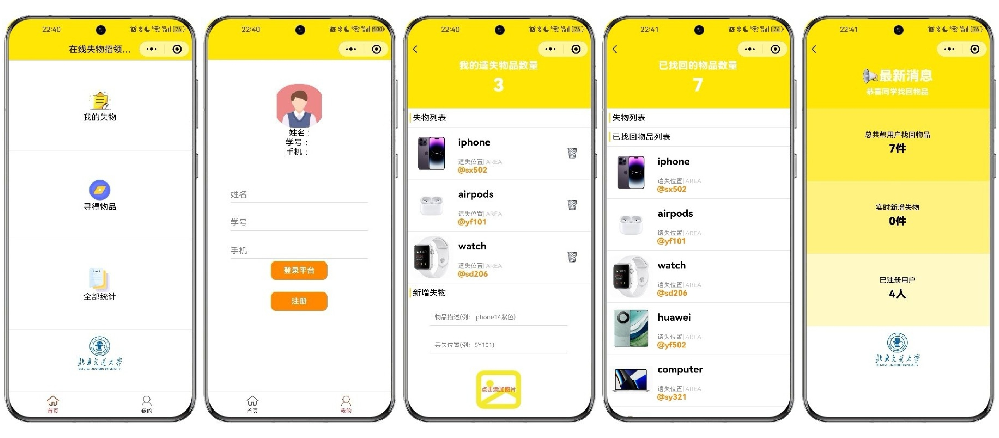

<div align="center">

# A Lost and Find WXAPP Base on MQTT Communication 

  
  
  
  
  
</div>

<div align="center">
  
  
  
  
  
  
</div>

### Menu

- [Contributors](#Contributors)
- [Introduction](#Introduction)
- [中文简介](#中文简介)
- [Quick start](#Quick-start)
- [Todo](#Todo)
- [License](#License)

## Contributors

<a href="https://github.com/JJLi0427/MQTT_LostFind_WXAPP/graphs/contributors">
  
</a>

## Introduction

We are a group of students from Beijing Jiaotong University aiming to develop a campus lost and found mini program. Having recognized the lightweight, convenient, and secure nature of the MQTT communication protocol, we have chosen to build our project around it. Currently, we have successfully crafted a comprehensive mini program interface and interactive logic. For the communication related to lost and found items, we have developed a communication client using Go language to interact with the backend database effectively.

### Project Structure

  

In this project, we have adopted a classical front-end separation approach. We have implemented a dual-message link architecture relying on MQTT communication. The front-end interface retrieves data from the backend database using DBAPI upon the launch of the Mini Program or page display. For operations like adding, deleting, and modifying data—such as uploading lost items or finding lost items—we have developed a global MQTT client in Go language based on message subscription communication.  

The client is designed to modify the server-side database, Mini Program only after receiving messages sent by the Mini Program. Communication between the Mini Program and the client is unidirectional, ensuring information security and efficient transmission. This setup aims to streamline the architecture while bolstering security and communication efficiency.

### Database Design

#### *For lost item*

| id | username | type | name | area | photo |
|----|----------|------|------|------|-------|
| int | String | Bool | String | String | BASE64(photo) |

* `id` each lost item will auto have an id in this table
* `username` is the woner name of lost property, it help us link to user table
* `type` means the lost item status
* `name` is the lost item name
* `area` is where you lost it
* `photo` show the lost item photo, *we will improve this feature in the future*

#### *For WXAPP user*

| studentid | username | phonenumber |
|-----------|----------|-------------|
| Bigint | String | Bigint |

* `studentid` consistent with the student id in school  
* `usewrname` every need a username
* `phonenumber` it help to contact with you

### MQTT Communication

In the Internet of Things communication, MQTT is the first choice of most people, this protocol adopts a publish/subscribe model, only subscribed to a specific topic can receive a specific message, all communication is based on the MQTT server to do the relay, which improves the security and transmission efficiency. Based on this, we develop a communication client between the Lost and Found Mini Program and the back-end database, receive the subscribed messages and then operate the database, so that we can ensure the security of information release and the efficiency of communication on campus.  

#### *An example of our MQTT client runtime*


### WXAPP Design



- `Home page`: Show the WXAPP function enterance
- `User page`: Show user information, everyone should long in WXAPP in tihs page at first
- `Lost page`: User can add and manage their lost item in this page
- `Find page`: If any user find a lost item, thry can upload in this page
- `Summary page`: Show the summary of WXAPP work history 

## 中文简介

团队来自于北京交通大学，项目旨在开发一个校园失物招领小程序。由于 MQTT 通信协议具有轻量，便捷和安全的特性，我们选择基于它构建我们的项目。目前项目已经实现了小程序界面和逻辑交互。对于失物招领相关的通信，我们使用 Go 语言的通信客户端，以便小程序与后端数据库进行高效的交互。

### 架构设计

在这个项目中，我们采用比较经典的前后端分离的方式。然后进一步我们依赖 MQTT 通信设计了一个双消息链路的架构。前端界面在小程序启动或者页面展示时通过DBAPI从后端数据库中获取数据。在上传失物或者是寻得失物等需要增删改操作数据的场景，我们专门用 Go 语言开发了一个全局的基于消息订阅方式来通信的 MQTT 客户端，客户端收到小程序发送的消息后才会对服务器中的小程序做修改，小程序对客户端的通信是单向的，以此保证信息安全和通信的高效。

### 数据库

我们设计了以下两个表来存储我们的业务数据:  

1. [失物表](#For-lost-item)存储了丢失物品相关的信息: `失物ID-id` `丢失用户名-username` `当前状态-type` `丢失地点-area` `照片-photo`

2. [用户表](#For-WXAPP-user)存储了用户相关的数据: `学生ID-studentid` `用户名-username` `手机号-phonenumber`

### MQTT通信

在物联网通信中，MQTT 是大部分人的首选，这个协议采用的是发布/订阅模式，只有订阅了特定的主题才能收到特定的消息，所有通信都是基于 MQTT 服务器做的中转，这提高了安全性和传输的效率。基于此开发失物招领小程序和后端数据库之间的通信客户端，接收订阅的消息然后再操作数据库，这样我们可以保证校园内的信息发布的安全性和通信的效率。 

### 小程序设计

我们总共为这个失物招领小程序设计了五个页面:   

- `主页`: 是小程序的入口，也是所有功能页面的入口
- `用户页`: 显示用户信息，所有用户都需要在这个页面先登录
- `丢失页`: 用户可以在这个页面上传和管理他们的失物
- `寻得页`: 找到了失物的用户可以在这个页面更新信息
- `总结页`: 程序运行历史记录总结

## Quick start

1. At first install these dependencies

    * [MySQL](https://www.mysql.com/) as our project database
    * [DBAIPI](https://www.51dbapi.com/) for WXAPP on load and some page on show
    * [EMQX](https://www.emqx.io/zh) help us build MQTT server 
    * [MQTT client wechat miniprogram](https://github.com/emqx/MQTT-Client-Examples/tree/master/mqtt-client-wechat-miniprogram) project help WXAPP connect the go client

2. Clone our repo or download our release code
3. Create a database through `project.sql`
3. `cd ./go` modify `config.json`, input your database and MQTT server configuration
4. Build go MQTT clinet from source code client.go and run it:
   
    ```shell
    go mod init client
    go mod tidy
    GOOS={$YOUR_SYSTEM} GOARCH={$YOUR_CPU} go build -o {$EXE_FILE_NAME} -ldflags '-w -s' ./*.go
    ./{$EXE_FILE_NAME}
    ```
    
6. Load WXAPP project through [Weixin DevTools](https://developers.weixin.qq.com/miniprogram/dev/devtools/download.html)
7. Change the IP and Port part of the WXAPP code

## Todo

**All we are completed**

1. -[x] ~~Optimized the MQTT client architecture and runs based on configuration files~~
2. -[X] ~~WXAPP implements online user registration~~
3. -[x] ~~WXAPP realize lost items'photo upload~~  

## License

This project is licensed under the [MIT License](https://opensource.org/license/MIT) - see the [LICENSE.txt](https://github.com/JJLi0427/MQTT_LostFind_wxapp/blob/main/LICENSE.txt) file for details.
